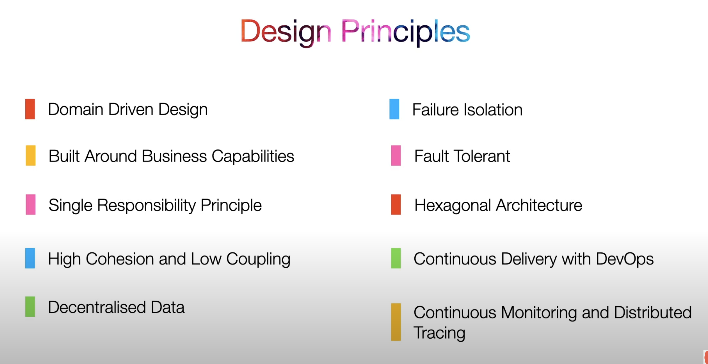
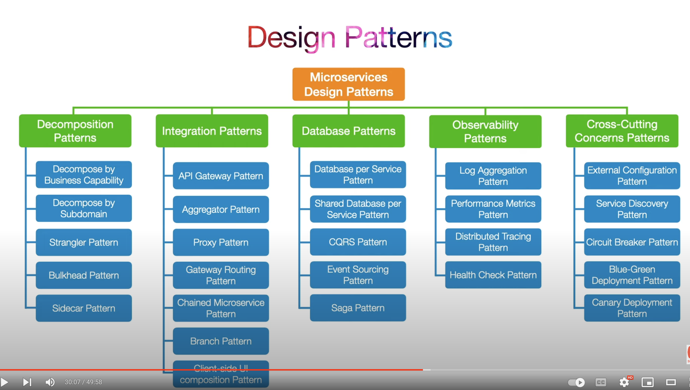
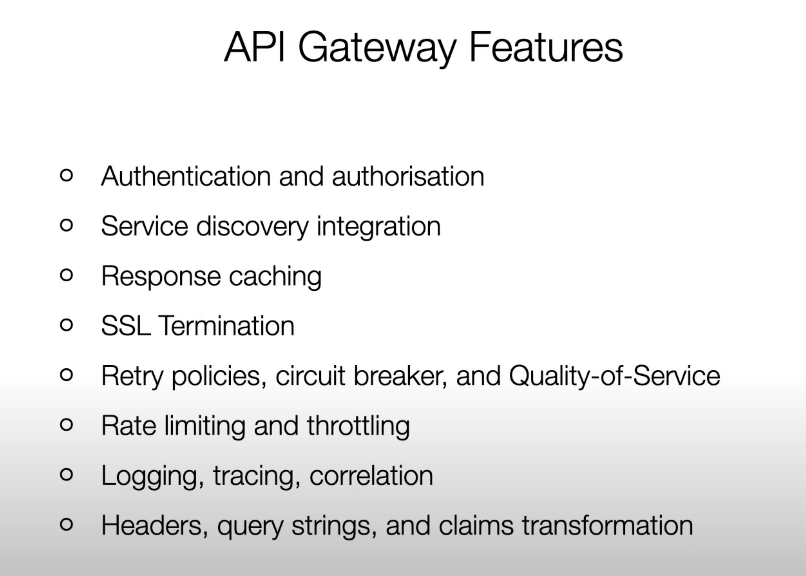
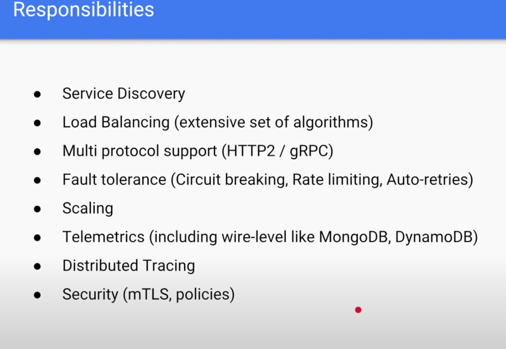
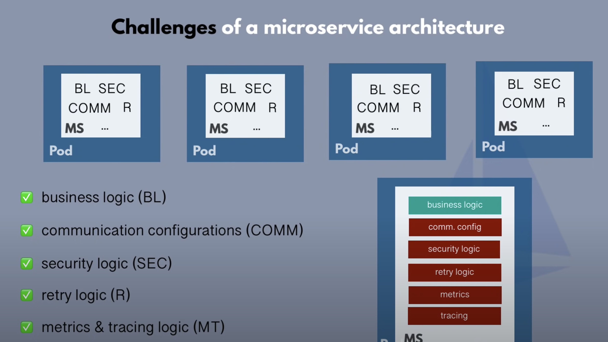

# MicroService(k8s)

## MicroService in General

* [10 Principles](https://www.developer.com/design/microservices-design-principles)

* [[Youtube-nana] MSA Overview](https://www.youtube.com/watch?v=rv4LlmLmVWk&ab_channel=TechWorldwithNana)

* [[Youtube] Design Microservice Architectures the Right Way](https://www.youtube.com/watch?v=j6ow-UemzBc&t=2081s&ab_channel=InfoQ)

## MicroService Design Patterns

* [[Youtube] Microservices Architecture Design Patterns | 10 Design Principles | 26 Design Patterns](https://www.youtube.com/watch?v=9QTsXLB6Al8&t=1246s&ab_channel=TechEFX)

### Circuit Breaker Pattern

[[Youtube] Circuit Breaker Pattern](https://www.youtube.com/watch?v=ADHcBxEXvFA&t=2s&ab_channel=DefogTech)

### API Gateway
#### Links
* [[Youtube] API Gateway](https://www.youtube.com/watch?v=vHQqQBYJtLI&list=PLhfHPmPYPPRk5WxsLhQIOEznHEeFJAoVM&index=3&ab_channel=DefogTech)

* [API Gateway pattern](https://microservices.io/patterns/apigateway.html)

## Istio & Service Mesh

* [[Youtube] Istio Setup in Kubernetes | Step by Step Guide to install Istio Service Mesh](https://www.youtube.com/watch?v=voAyroDb6xk&ab_channel=TechWorldwithNana)

* [[Youtube] Istio & Service Mesh - simply explained in 15 mins](https://www.youtube.com/watch?v=16fgzklcF7Y)

* [[Youtube] What is a service mesh?](https://www.youtube.com/watch?v=QiXK0B9FhO0&t=13s)

* [[Youtube] Istio Service](https://www.youtube.com/watch?v=6zDrLvpfCK4)

### Istio

## Challenge of MicroService Archeitecture

