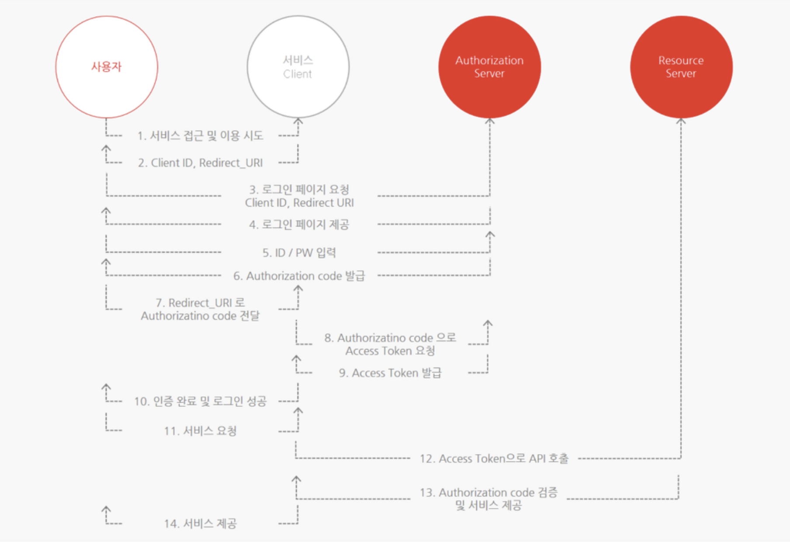
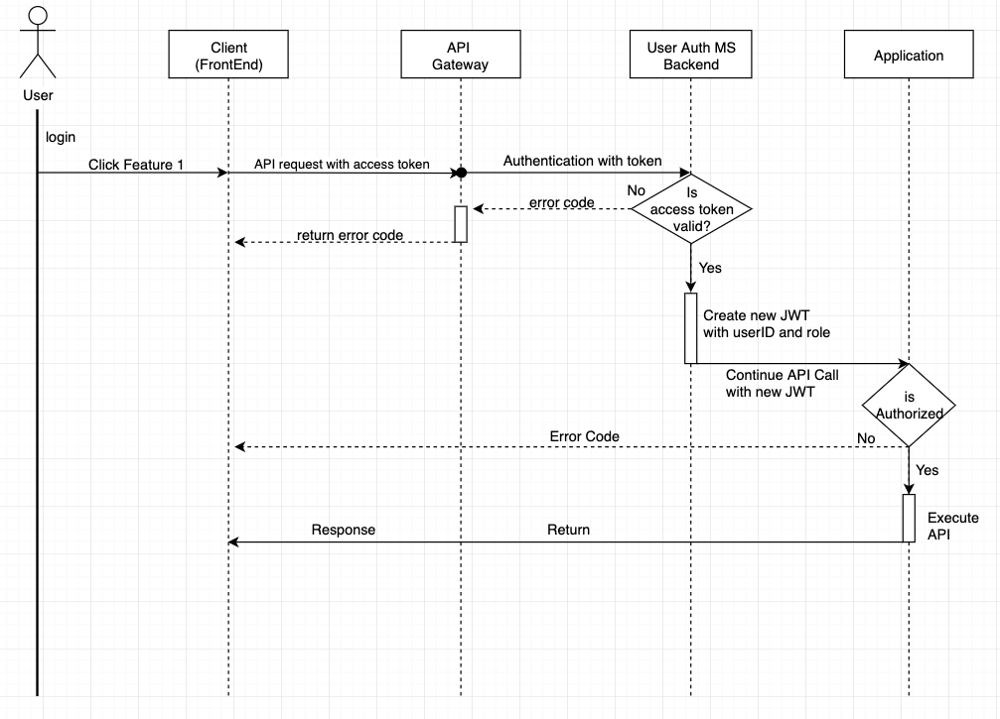
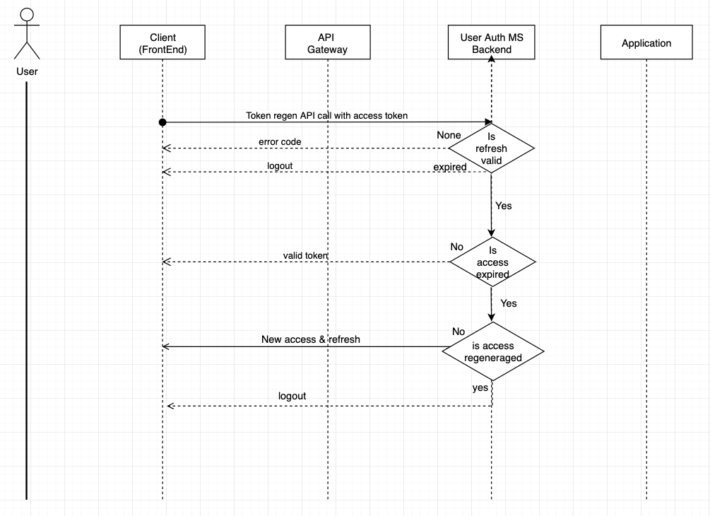
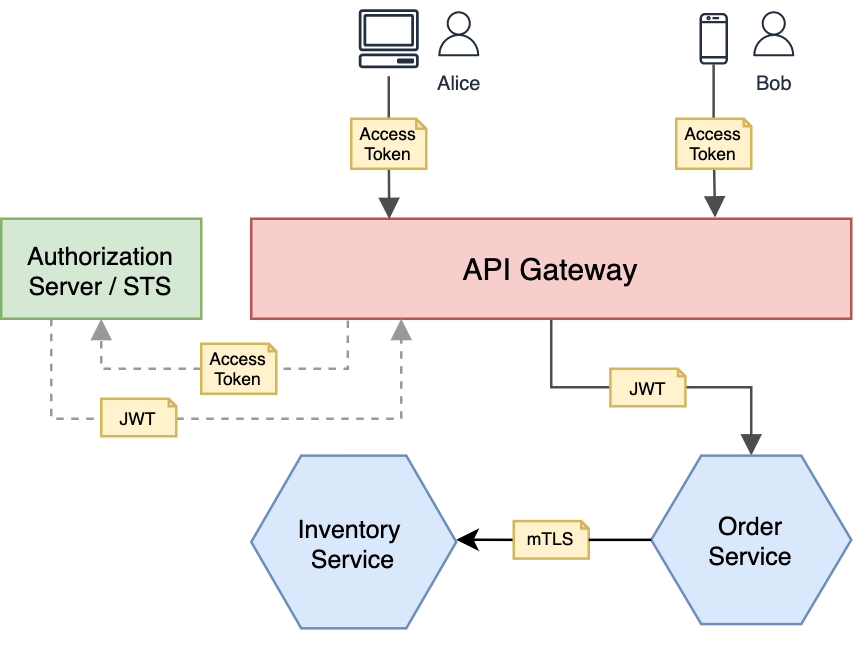

# Architecture

`User-Auth` microservice에는 크게 아래와 같이 3가지 요소를 갖고 있다. 

1. OAuth2.0 and OpenID connect (with 3rd party providers)
2. Token 관리 (Authentication & Authorization)
3. User 관리


## OAuth2.0 and OpenID Connect
본 서비스에서는 3rd party providers를 연동하여 login 기능을 대체하며, Authorization server에서 발급 받은 token을 사용하여 resource server에서 제공하는 기능과 scope에 포함된 정보를 가져온다.   
사실상 프로젝트 초기 버젼에서는 Authorization server와 통신할 빈도가 적을 예정이며, 로그인 기능을 위해 OAuth2.0 and OpenID connect을 사용하게 된다.  실제 Client가 Backend와 통신하기 위해 사용하는 token은 `User-Auth` microservice에서 발급 및 관리 할 예정이다.  


### OAuth2.0 Flow



### Features to implement
#### 8. Authorization code로 Access Token 요청
Client ID, Secret, Auth Code, etc를 포함하여 Authorization Server에 Access token 요청

#### 9. Access Token 발급
발급 받은 Access & Refresh Token을 안전하게 저장
#### 10. 인증 완료 및 로그인 성공
10번 단계가 완료 되면 필요 정보를 DB에 저장하고 내부에서 새로운 access token & refresh token을 발급하고 client에게 전달한다.  

#### 12, 13, 14는 아직 미정


### 구현 필요 API 정의

```bash
/api/auth/..
/api/auth/..
/api/auth/..
```


### Useful Links
* [[Youtube] OAuth 2.0 and OpenID Connect](https://www.youtube.com/watch?v=996OiexHze0)

* [OAuth2.0 개념정리](https://inpa.tistory.com/m/entry/WEB-%F0%9F%93%9A-OAuth-20-%EA%B0%9C%EB%85%90-%F0%9F%92%AF-%EC%A0%95%EB%A6%AC)


## Access & Refresh Token (Authentication & Authorization)
jwt형식의 access, refresh token을 `user-auth` ms에서 직접 발급하며 관리 한다.  
### Token Sequence Diagram

1. 로그인을 한 사용자가 Client를 통해 API를 호출 하였을때(Authentication & Authorization)  


2. Access token이 만료된 사용자가 재발급을 요청 하였을때



### 구현 필요 API 정의

```bash
/api/auth/..
/api/auth/..
/api/auth/..
```


## Authentication in MicroService
### Breif Idea


### API Gateway


### Service Mesh (Istio)